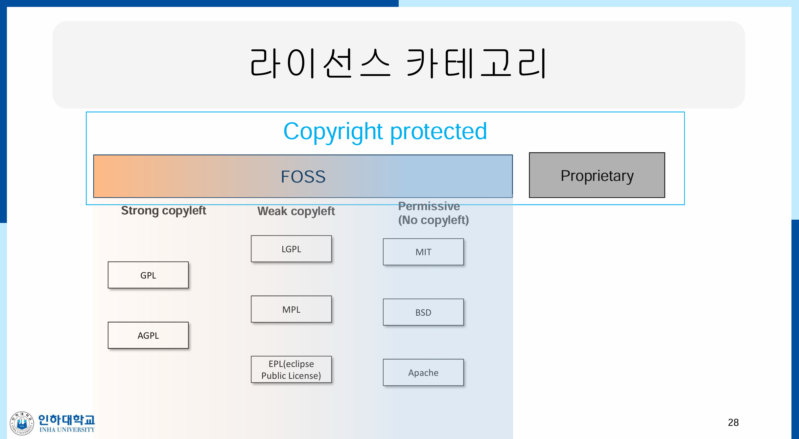

# [오픈소스응용프로그래밍] 01. 오픈소스 SW란?

# 오픈소스 SW란?

## 오픈소스 SW

- 소스코드와 함께 배포되어 **수정 및 재배포가 가능**한 소프트웨어
- MySQL, 아파치, Linux 등이 있다

# 저작권과 라이센스

- 저작권: 소프트웨어를 창작했을 때 자동적으로 발생
    - 뿌렸다고 해서 저작권이 **없는 게 아니다**

## 저작권과 라이센스의 차이점

- 저작권: 말 그대로 창작자가 갖는 권리의 명시
- 라이센스: 이 저작권을 타인에게 어떻게 부여할 수 있는지,,,

# 독점 소프트웨어와 자유 소프트웨어

## 독점 소프트웨어

- 독점 소프트웨어: 소유자가 수정 및 배포 권리를 독점
    - 따라서 **binary code**를 사용하기 위해서는 비용을 지불해야 함
        - 소스코드가 아니라 binary code !! !! 소스코드에는 접근할 수 없다.

## 자유 소프트웨어(Free SW)

- 사용에 **비용이 안 드는 게 아니라**, 소스코드를 공개하여 **수정과 배포가 자유로움**

### GNU 프로젝트

- 1992년에 시작됨
- GNU is not Unix
- 근데 크게 중요한 내용은 아니라고 한다

### 자유 소프트웨어의 원칙

- F0: 원하는 목적으로 프로그램을 자유롭게 실행할 수 있는 자유
- F1: 프로그램의 소스 코드를 파악하고 변경할 수 있는 자유
- F2: 정확한 복사본을 배포할 수 있는 자유
- F3: 복사본을 만들고, 원하는 대로 수정된 버전을 배포할 수 있는 자유

# Copyleft 라이선스

- 자유 소프트웨어 + **공유 의무**
- 재배포 시 자신이 받은 것과 동일한 자유를 해당 재배포 소프트웨어 사용자들에게 부여해야 함

## GPL 라이선스

- General Public License
- 최초의 Copy left 라이선스

## LGPL 라이선스

- GPL보다 좀 더 완화됨
    - GPL은 독점 소프트웨어와의 결합이 불가능한데, LGPL은 가능함
- binary code 안에 소스 코드가 포함된다면 공개해야 함
- 근데 **동적 링크로 따온다면** 공개하지 않아도 됨

# Open Source

- GNU 철학을 대부분 계승하지만 **재배포 시 자유롭게 라이선스를 부여 가능**하도록 함

## Permissive 라이선스

- `BSD 라이선스` 라고도 부른다
    - Berkeley Software Distribution
- 자유로운 사용, 수정 재배포 허용
- copyleft와 달리 **재배포 시 어떤 라이선스를 부여할 것인지에 대한 자유**를 부여함
- 예시: BSD라이선스, MIT 라이선스, Apache 라이선스 등

# FOSS

- Free and Open Source Software(free+open source)
- Free software
    - Freeware와 Shareware
        - Freeware: 무료
        - Shareware: 평가판은 무료로 사용하고 이후 비용이 든다
    - 사용 비용이 Free인 거지 소스코드 공개는 x

### FOSS의 장점

- 소프트웨어 사용 비용 절감
    - 기업들은 유사한 상용 소프트웨어 대신 FOSS를 사용함으로써 상당한 라이선스 비용을 피할 수 있음. 많은 기업에서 리눅스 기반 운영체제를 활용하고 있음
- 소프트웨어 개발 시간 및 비용 절감
    - 기존의 OSS 기반으로 개발을 진행하여 처음부터 다양한 기능을 다 개발하는 것보다 훨씬 빠르게 저비용으로 개발 가능함
- 신뢰성
    - 소스코드가 공개되어 있으므로 많은 사람들에 의해 테스트되고 그에 따른 버그나 취약점 등을
     보완하여 신뢰성을 확보할 수 있음
- 외부지원
    - 많은 경우 OSS는 커뮤니티를 갖추고 있어 질문 및 답변이 활발함
- 특정 소프트웨어 제작사에 대한 락인(lock-in) 완화
    - 특정 기업의 다양한 소프트웨어를 함께 사용하다가 다른 기업의 소프트웨어를 도입하려면 비용이 많이 발생하게 됨. OSS의 개방성 및 호환성은 이를 완화할 수 있음

# 공개 도메인 SW

- 저작권 아예 포기함
- 오픈소스, Free SW 모두 저작권은 있다. 따라서 공개 도메인 SW는 아니다